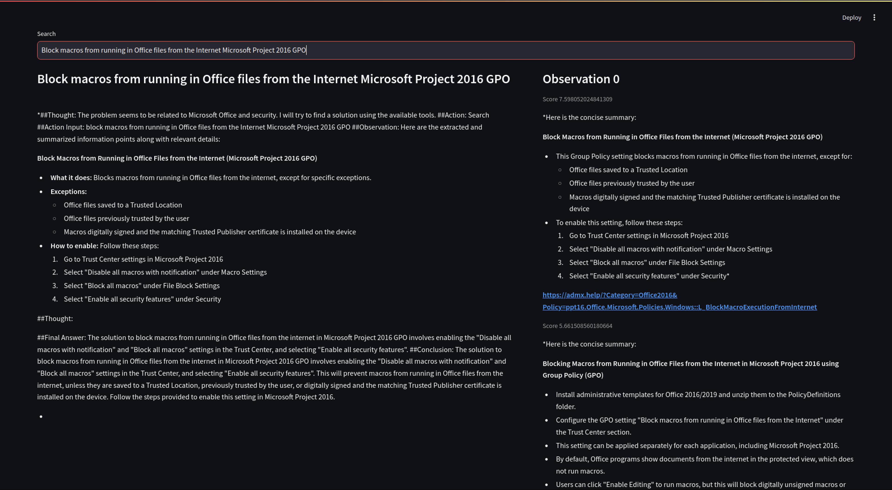

# An AI Quick Search Engine and a ReAct Search Agent
This project aims to create two search mechanisms. 
An AI model review and summary the search results to answer user's query. This approach saves user a lot of time skimming through results to find the answer. In addition, the AI response to user's query bases on real data and user can go to the source of the data to verify when necessary.
A ReAct agent to research a topic/query provided by user. The ReAct agent's advantage is that it not only returns the answer but also generates some new ideas along the way which can help the user brainstorming a task/project. The search agent's answers base on real data and user can go to the source of the data to verify when necessary.

# Roadmap
## System
+ Build up connection between ReAct Search agent core and web client layout
## ReAct agent
+ Check on the agent memory display, why there are 2 final answer prompts
+ Add a conclusion prompt to help the agent conclude the research better
+ Need to train the LLM model so it can familiarise with the ReAct agent instruction structure
## Web layout
+ Add a webpage for the ReAct Search agent
+ Put search bar down and stick to the web window
+ Add up search history without regenerate the whole webpage

# Random Bugs
## PlayWright Sync request with concurrent thread problem
+ Try agent search with query like "ISM GPO guideline"

# Test Run
## LLM Assisted Search Engine

## LLM Search ReAct Agent

